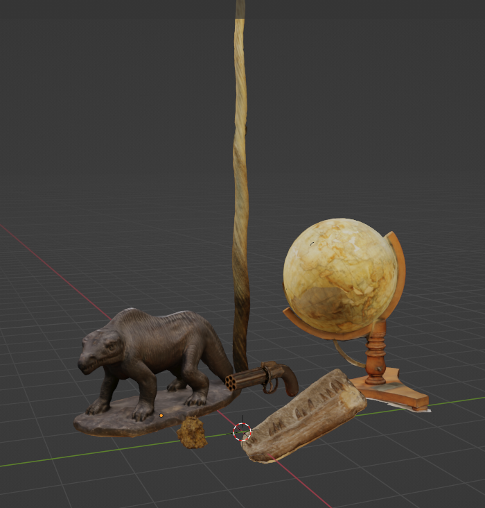
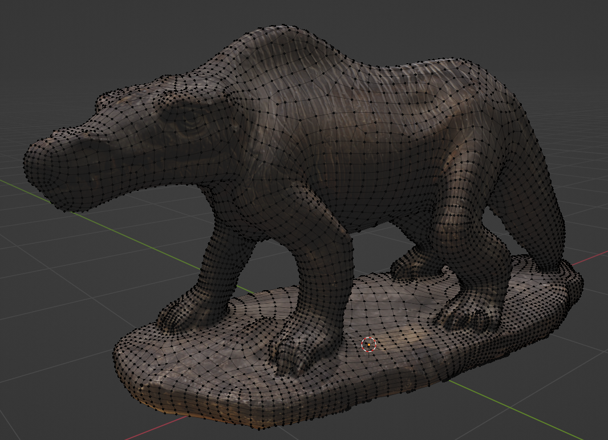
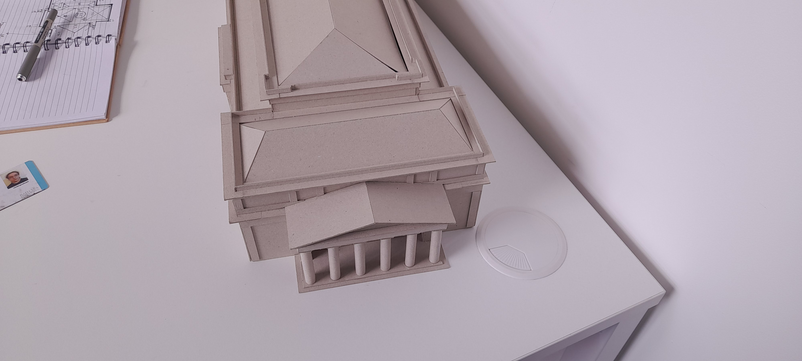

[Github repo](https://github.com/ethobat/brlsi-virtual-museum)

In 2022, as part of my university course, I worked on a Unity project for the Bath Royal Literary and Scientific Institution.

The goal of the project was to create a prototype virtual museum in Unity, using photogrammetry technology (Agisoft Metashape) to create digital models of the artefacts.

I led the project and made most of the creative and design decisions. I was responsible for bringing together everyone's work in Unity at the end of the project.

[Demo video](https://youtu.be/RO2QDUvG9jk)

Several artefacts were brought in from the museum and digitized to create the virtual exhibits.

I was also responsible for creating a digital model of BRLSI's old building using a physical model as reference. This model was used by another group of students for a different project next year.

The project was displayed at an exhibition at Burdall's Yard in Bath.