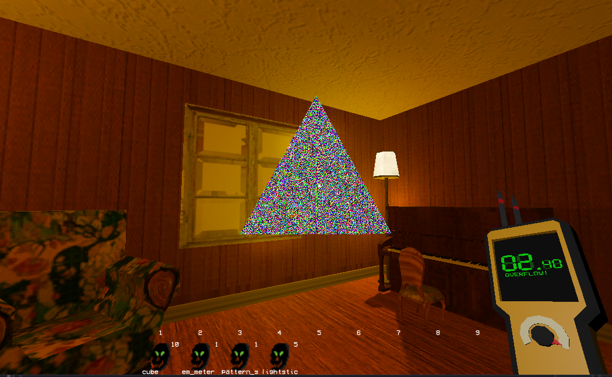

[Github repo, old](https://github.com/ethobat/commercial-games-project)
[Github repo, new](https://github.com/ethobat/faceless-fears)

"Faceless Fears" was a game developed in Unity and uploaded to itch.io as a project in my final year of university.

It's a short "anomaly horror" game where the player patrols an uninhabited house, fixing objects that have been affected by a supernatural force. I wrote the majority of the code and handled the graphics, including shaders and lighting.

The game received positive reception on itch.io, so me and two other former students decided to continue working on it. We're currently rebuilding the game in Godot with a larger scope and more complex gameplay. We won a £2000 award from [Launch It](https://www.launchit.org.uk/) which is being used to develop the game.

