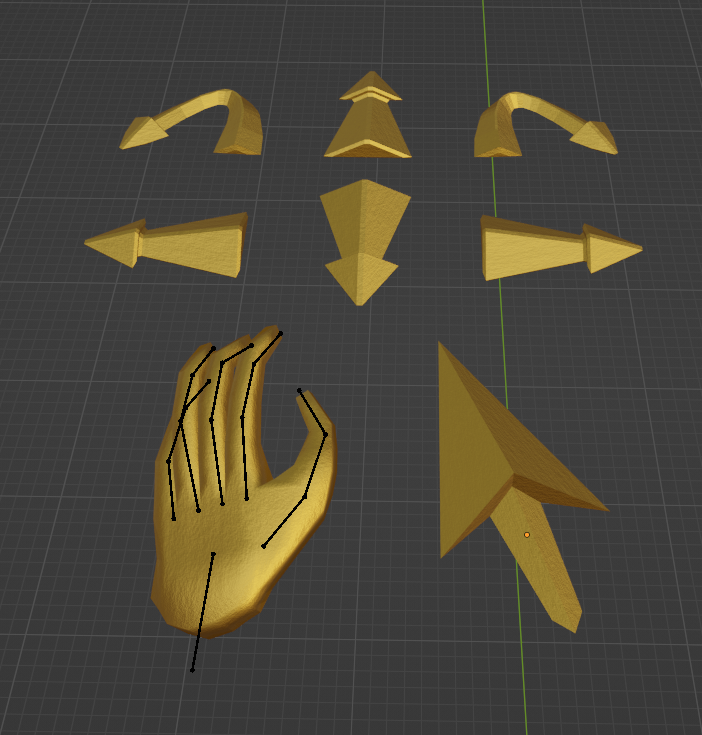
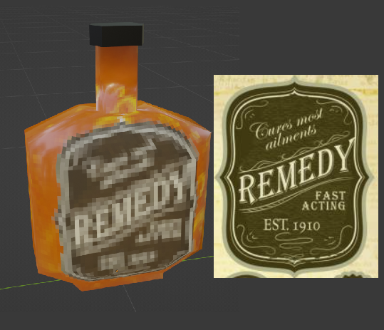
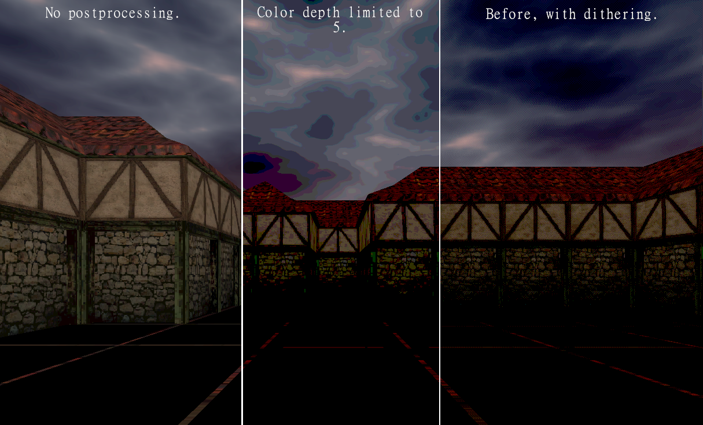
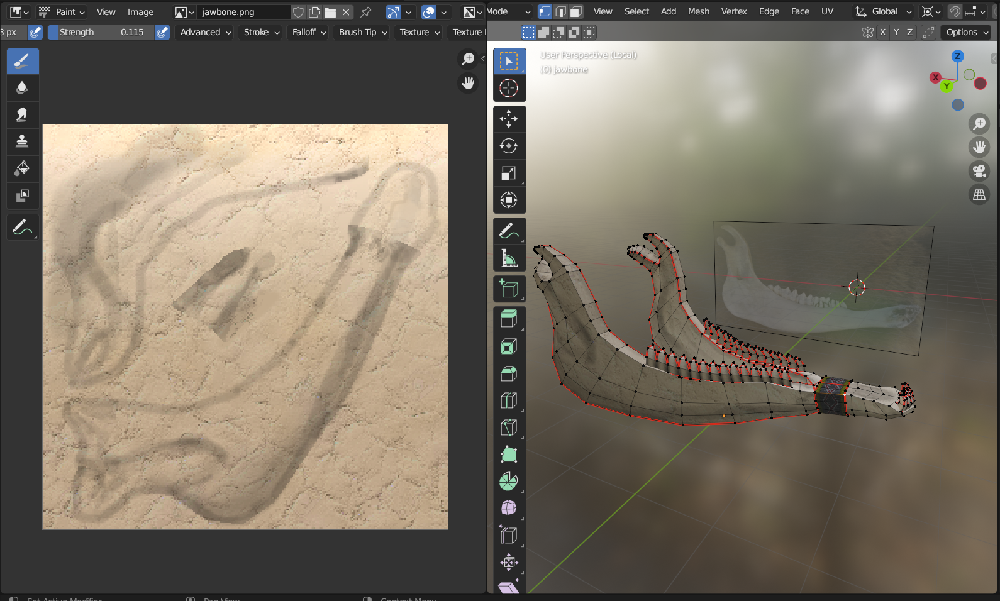
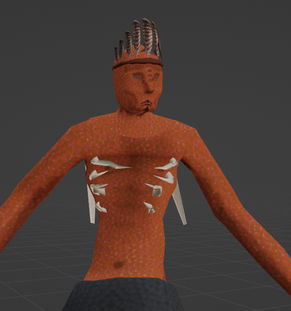
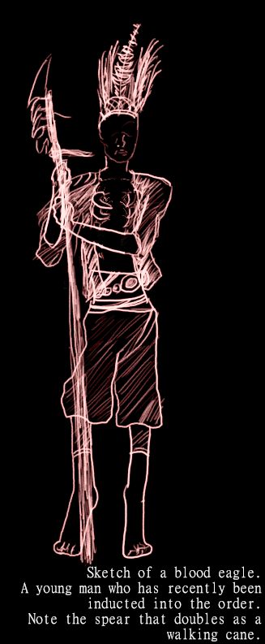
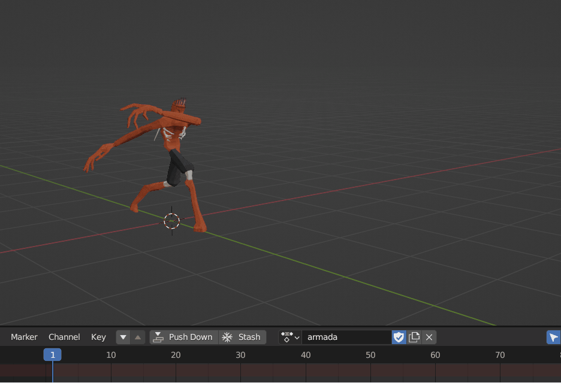
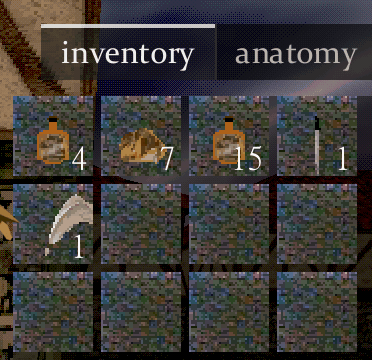

[Github repo](https://github.com/ethobat/gospel)

This was a somewhat open-ended solo university project. My goal was to create a prototype for a first-person dungeon crawler game. I spent most of my time with the project honing in on a particular style for the graphics and UI.

The golden arrow icons used for the UI movement buttons and the cursor are prerendered 3D models made in Blender.

All of the textures are photos from various places, manipulated using GIMP to achieve a sufficiently "crunchy" feeling. This is combined with in-engine postprocessing to achieve a dark, moody feeling.

I used Blender's texture painting feature to create the jawbone model, adding extra detail and depth to the surface of the model without adding extra geometry. The base texture is a simple bone texture from the internet, and I added contours by darkening certain areas.

This project was also my first foray into character modelling, rigging, and implementing animations from Mixamo. This still isn't my strong suit.

Some miscellaneous gifs, featuring programmatic animations:

