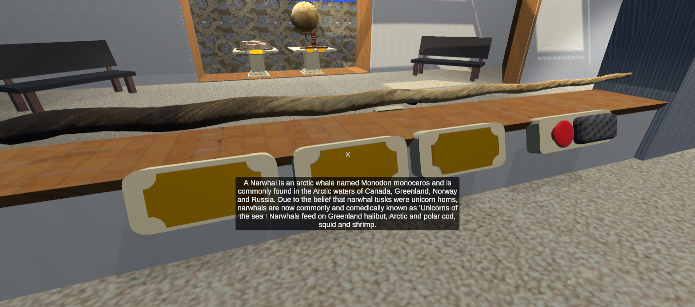
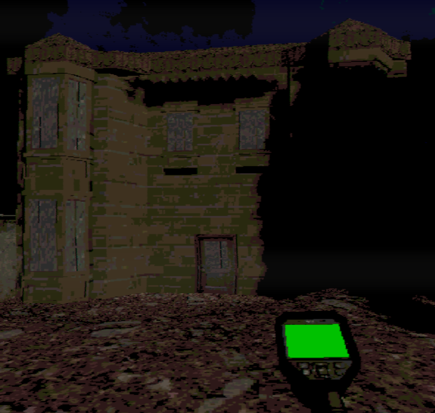
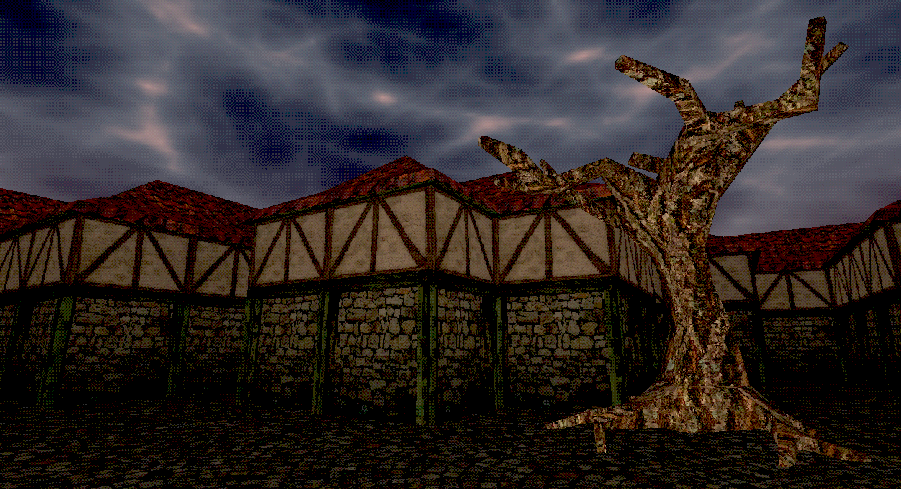

An aspiring programmer, 3D artist and game developer.

# Projects

## [BRLSI virtual museum](brlsi.md)
*Software used: Unity, C#, Blender, Metashape*

---

## [Faceless Fears](faceless-fears.md)
*Software used: Unity, C#, Blender, Godot*

---

## [Godot game prototype](gospel.md)
*Software used: Godot, Blender, GIMP*

---

## [Miscellaneous visual work](misc-visual-work.md)
*Software used: Blender, GIMP, Autodesk Maya*

---

## [Miscellaneous programming work](misc-code-work.md)
*Software used: Various languages including C#, Python, C++ and Javascript*