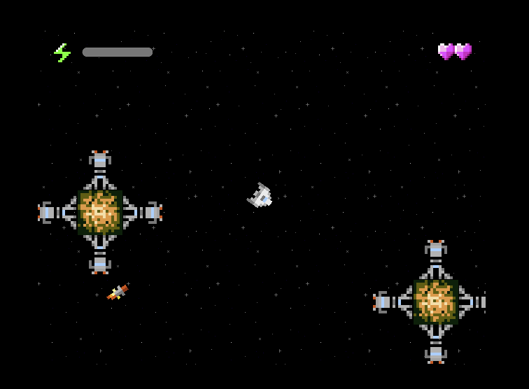

#### Reverse-engineering an RPG Maker game in Unity

This was a project to reverse-engineer a Pokemon fangame made in RPGMaker and transfer the data and assets into Unity. The project involved decompiling the encrypted assets in the downloadable game and processing them with a set of online tools and Python scripts into formats that were usable in Unity.

There was no information online about many of the data formats used by the original engine, particularly map data and event data, so I had to reverse engineer them by cross-referencing the appearance or behavior of an object in the game with the binary data.

In places where reverse engineering the extracted data was too difficult, I also wrote a few webscraping scripts to gather data directly from the game's wiki.

This project isn't online, because most of the files in the repository (i.e. assets and reverse-engineered game data) are someone else's work.

---

#### Construct 3 project

[Link](https://ethobat.itch.io/insane-space-combat-simulator-dx)

University project - an Asteroids-inspired space shooter made in Construct 3 and playable in browsers.

---

#### Javascript word game

[Link](https://editor.p5js.org/ethobat/sketches/W4I2gZWKD)

A word game written in Javascript. The goal is to bridge the gap between two words, where each pair of words must have a Levenshtein distance of 2 or less.

---

